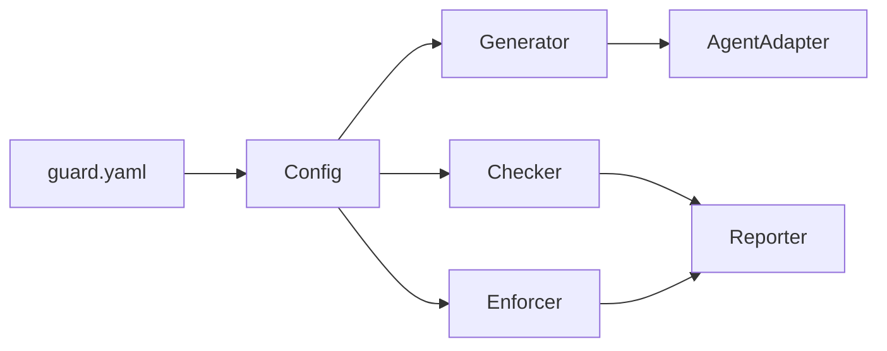

# AI Guard

**Guardian system for AI coding agents — behavior constraints and code quality gates.**

[English](README.md) | [中文](README_zh.md)

> [!NOTE]
> AI Guard is under active development. The system design is complete; Phase 1 implementation is in progress.

## What is AI Guard?

AI coding agents (Claude Code, Cursor, OpenCode, etc.) can autonomously read/write files, execute commands, and generate code. AI Guard provides a unified guardrail system that:

- **Constrains behavior** — intercept dangerous operations at runtime via agent hooks (e.g., force push, secret file access, bypassing checks)
- **Gates code quality** — enforce formatting, linting, naming conventions, and custom checks at commit/push time
- **One config, all agents** — a single `guard.yaml` drives rules for every supported AI agent

## Supported Agents

| Agent | Behavior Interception | Code Quality Gates |
|-------|----------------------|-------------------|
| Claude Code | Full (Hook) | Full |
| Cursor | Full (Hook) | Full |
| OpenCode | Full (Plugin) | Full |
| GitHub Copilot | Rule doc only | Full |
| KiloCode | Rule doc only | Full |

## Architecture

| Module | Responsibility |
|--------|---------------|
| **Config** | Load, merge, and validate configuration |
| **Generator** | Produce rule docs, hook scripts, tool configs, and git hooks |
| **AgentAdapter** | Adapt unified rules to agent-specific formats |
| **Enforcer** | Runtime policy matching and decision (allow / deny / ask) |
| **Checker** | Orchestrate commit/push verification |
| **Reporter** | Format and deliver check results and audit logs |

## Roadmap

- [x] System design complete
- [ ] **Phase 1** — Config + Generator + CLI (8 commands)
- [ ] **Phase 2** — Enforcer + runtime behavior interception
- [ ] **Phase 3** — Checker + Reporter + code quality gates

## Documentation

- [System Design Document](design/AI_GUARD_SYSTEM_DESIGN.md) — full architecture, module design, interfaces, and data models

## Requirements

- Python >= 3.10
- Git >= 2.20

## License

[MIT License](LICENSE)
