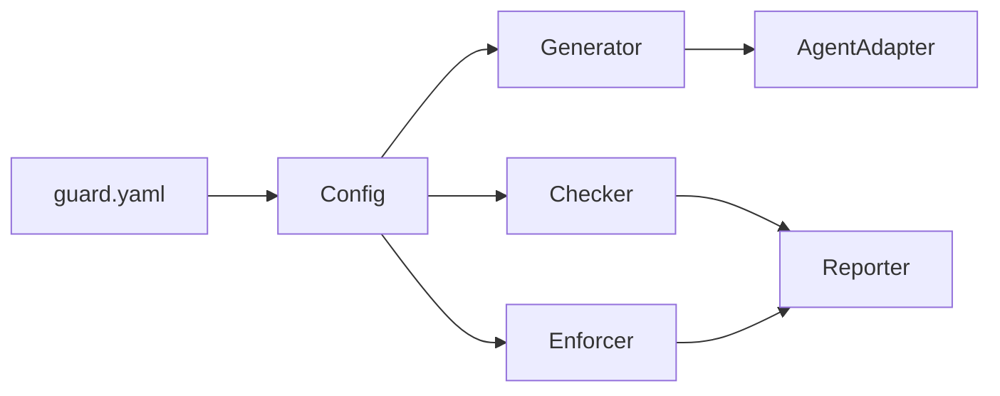

# AI Guard

**Guardian system for AI coding agents — behavior constraints and code quality gates.**

[English](README.md) | [中文](README_zh.md)

> [!NOTE]
> AI Guard is under active development. Phases 1-3 are complete; Phase 4 (Ruleset Management) is in progress.

## What is AI Guard?

AI coding agents (Claude Code, Cursor, OpenCode, etc.) can autonomously read/write files, execute commands, and generate code. AI Guard provides a unified guardrail system that:

- **Constrains behavior** — intercept dangerous operations at runtime via agent hooks (e.g., force push, secret file access, bypassing checks)
- **Gates code quality** — enforce formatting, linting, naming conventions, and custom checks at commit/push time
- **One config, all agents** — a single `guard.yaml` drives rules for every supported AI agent

## Quick Start

```bash
# Install from source
pip install -e .

# Initialize configuration
guard init --language python

# Install artifacts for your agent
guard install --agent claude-code

# Run commit-stage quality checks
guard check

# Fetch a shared ruleset
guard ruleset fetch https://github.com/company/rules.git#v1.0
```

## CLI Commands

| Command | Description |
|---------|-------------|
| `guard init` | Generate a `guard.yaml` configuration file |
| `guard install` | Install rule docs, hook scripts, and git hooks for agents |
| `guard update` | Re-generate all artifacts from latest config |
| `guard uninstall` | Remove all generated artifacts |
| `guard status` | Show installation status and drift detection |
| `guard doctor` | Run environment diagnostics |
| `guard agents` | Display agent capability matrix |
| `guard check` | Run commit-stage quality checks |
| `guard verify` | Run full push-stage validation |
| `guard run <name>` | Run a single named check item |
| `guard ruleset fetch` | Fetch a ruleset from a git repository |
| `guard ruleset list` | List cached rulesets |
| `guard ruleset cache clear` | Clear the ruleset cache |

## Supported Agents

| Agent | Behavior Interception | Code Quality Gates |
|-------|----------------------|-------------------|
| Claude Code | Full (Hook) | Full |
| Cursor | Full (Hook) | Full |
| OpenCode | Full (Plugin) | Full |
| GitHub Copilot | Rule doc only | Full |
| KiloCode | Rule doc only | Full |

## Architecture



| Module | Responsibility |
|--------|---------------|
| **Config** | Load, merge, and validate configuration |
| **Generator** | Produce rule docs, hook scripts, tool configs, and git hooks |
| **AgentAdapter** | Adapt unified rules to agent-specific formats |
| **Enforcer** | Runtime policy matching and decision (allow / deny / ask) |
| **Checker** | Orchestrate commit/push verification |
| **Reporter** | Format and deliver check results and audit logs |
| **Ruleset** | Fetch, cache, and manage shared external rulesets |

## Roadmap

- [x] System design complete
- [x] **Phase 1** — Config + Generator + CLI (8 commands)
- [x] **Phase 2** — Enforcer + runtime behavior interception
- [x] **Phase 3** — Checker + Reporter + code quality gates
- [ ] **Phase 4** — Ruleset fetch, caching, and management
- [ ] **Phase 5** — PR report posting and CI/CD integration

## Documentation

- [System Design Document](design/AI_GUARD_SYSTEM_DESIGN.md) — full architecture, module design, interfaces, and data models

## Requirements

- Python >= 3.10
- Git >= 2.20

## License

[MIT License](LICENSE)
