# AI Code Guard

Guardrails for AI coding agents. One `guard.yaml` constrains behavior and enforces code quality across Claude Code, Cursor, OpenCode, Copilot, and KiloCode.

A single config file replaces per-agent rule documents, scattered hook scripts, and manual pre-commit setup.

- **Runtime interception** — agent hooks block dangerous operations (force push, secret access, config tampering) before they execute
- **Code quality gates** — format, lint, naming, and custom checks at commit and push time
- **Anti-bypass protection** — the agent cannot modify its own constraints, disable hooks, or skip checks
- **5 agents, 1 config** — `guard.yaml` generates agent-specific rule docs, hook scripts, pre-commit config, and policy files

## Installation

```bash
pip install ac-guard
```

> The CLI command `ac-guard` abbreviates **AI Code Guard** (ac = AI Code).

## Quick Start

```bash
ac-guard init --language python          # create guard.yaml
ac-guard install --agent claude-code     # generate rules + hooks
ac-guard check                           # run quality checks
ac-guard check --format json             # machine-readable output for CI
ac-guard ruleset fetch <url>#v1.0        # fetch shared ruleset
```

New here? Walk through the full flow in the
[15-minute Getting Started guide](docs/getting-started.md).

## Supported Agents

| Agent | Runtime Hook | Code Quality | Rule Document |
|-------|:---:|:---:|---|
| Claude Code | deny + ask | yes | `CLAUDE.md` |
| Cursor | deny | yes | `.cursor/rules/behavior.mdc` |
| OpenCode | deny + ask | yes | `AGENTS.md` |
| GitHub Copilot | — | yes | `.github/copilot-instructions.md` |
| KiloCode | — | yes | `.kilocode/rules/behavior.md` |

Agents with runtime hooks intercept operations before execution. Agents without hooks receive behavior rules as soft constraints in their rule documents. All agents get pre-commit quality gates.

## Configuration

```yaml
behavior:
  write:
    forbidden:
      - pattern: "file:.git/**"
      - pattern: "file:**/.env"
    require_approval:
      - pattern: "file:guard.yaml"
  execute:
    forbidden:
      - pattern: "shell:git push --force*"
      - pattern: "shell:git commit --no-verify*"

code:
  commit:
    format: true
    naming: true
  push:
    lint: true
```

Patterns use `{scheme}:{glob}` format — `file:`, `shell:`, `mcp:`, `web:`. Add `regex: true` for regex matching.

Rules are evaluated in priority order: **forbidden** (deny) > **require_approval** (ask user) > **allow** > default allow.

See [guard.yaml reference](design/AI_GUARD_SYSTEM_DESIGN.md) for full schema.

## Commands

| Command | Description |
|---------|-------------|
| `ac-guard init` | Generate `guard.yaml` from presets |
| `ac-guard install --agent <name>` | Generate rules, hooks, and configs |
| `ac-guard update` | Regenerate after config changes |
| `ac-guard uninstall` | Remove generated artifacts |
| `ac-guard check` | Run commit-stage checks |
| `ac-guard verify` | Run push-stage validation |
| `ac-guard run <name>` | Run a single check |
| `ac-guard gate run --stage <s>` | Git hook entry point |
| `ac-guard status` | Installation state and drift detection |
| `ac-guard doctor` | Environment diagnostics |
| `ac-guard agents` | Agent capability matrix |
| `ac-guard ruleset fetch` | Fetch a ruleset from a git repository |
| `ac-guard ruleset list` | List cached rulesets |
| `ac-guard ruleset show <name>` | Show ruleset details and rules |
| `ac-guard ruleset cache clear` | Clear the ruleset cache |
| `ac-guard validation list` | List configured checks by stage |
| `ac-guard validation report` | Check configuration report table |

All check commands (`check`, `verify`, `status`) support `--format json` for machine-readable output in CI/CD pipelines.

## How It Works

`ac-guard install` reads `guard.yaml` and generates all artifacts at once — rule documents, hook scripts, `.pre-commit-config.yaml`, and `.ac-guard/runtime.json`. No config parsing happens at runtime.

When the agent runs, its hook script loads the pre-built policy and matches each operation against the rules. Forbidden operations are blocked. Operations requiring approval prompt the user. Everything else is allowed. Every decision is logged to `.ac-guard/audit.jsonl`.

At commit and push time, pre-commit hooks run format, lint, naming, and custom checks. The agent cannot skip these because `git commit --no-verify` is itself a forbidden pattern.

Check results can be posted as PR comments on GitHub, GitLab, Gitea, and Bitbucket via the `output.pr_report` configuration. When `enabled: true`, `check`, `verify`, and `gate run` automatically publish a comment on the associated PR after execution. If no PR can be identified in the current context (e.g. local branch, no PR open yet), the dispatch is silently skipped — no noise in local development.

## Roadmap

```mermaid
flowchart LR
    P1[✅ Phase 1<br/>Config + Generator + CLI] --> P2[✅ Phase 2<br/>Enforcer]
    P2 --> P3[✅ Phase 3<br/>Checker + Reporter]
    P3 --> P4[✅ Phase 4<br/>Ruleset Management]
    P4 --> P5[✅ Phase 5<br/>PR Report + CI/CD]
    P5 --> M6[🚧 M6<br/>Production Readiness]
    M6 --> M7[📋 M7<br/>Examples + Ecosystem]

    classDef done fill:#90EE90,stroke:#2d7a2d,color:#000
    classDef active fill:#FFE4B5,stroke:#b8860b,color:#000
    classDef planned fill:#D3D3D3,stroke:#666,color:#000
    class P1,P2,P3,P4,P5 done
    class M6 active
    class M7 planned
```



## Development

### First-time setup (fresh clone)

```bash
pip install -e ".[dev]"              # installs ruff, pytest, interrogate, bandit, import-linter
ac-guard install --agent claude-code # materialises runtime.json + Claude Code hook + git hooks
```

That's it — `ac-guard install` writes its own `.git/hooks/pre-commit` wrapper
that delegates to `ac-guard gate run --stage commit`, so no separate
`pre-commit install` step is needed. The committed [`guard.yaml`](guard.yaml)
and [`CLAUDE.md`](CLAUDE.md) are the source of truth for agent behavior rules;
everything under `.claude/hooks/`, `.ac-guard/`, and `.git/hooks/` is
per-machine and generated locally.

### Day-to-day

```bash
pytest                    # 900+ tests
ruff check .
pre-commit run --all-files
```

The repository's own quality gate runs the same suite in CI
(`lint` + `pre-commit` + `test` jobs in `.github/workflows/ci.yml`).
Import layering rules live in `.importlinter`; docstring coverage
threshold and bandit skips in `pyproject.toml`.

### Self-hosted via ac-guard

This repo is dogfooded: its own behavior gate is managed by a committed
[`guard.yaml`](guard.yaml) and installed via `ac-guard install --agent
claude-code`. The ac-guard-owned ruff format / lint hooks live inside
the `# AI-GUARD:BEGIN` / `# AI-GUARD:END` block of
`.pre-commit-config.yaml`; everything else (interrogate, bandit,
import-linter, conventional-pre-commit, pre-commit-hooks hygiene) sits
outside the block and is preserved across `ac-guard install` runs.

## Changelog

See [CHANGELOG.md](CHANGELOG.md) for release notes and known limitations.

## License

[MIT](LICENSE)
