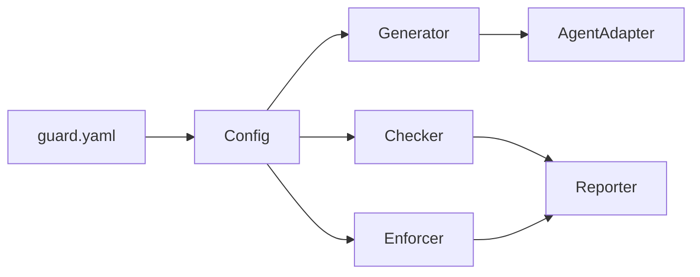

# AI Guard

**面向 AI 编码 Agent 的看护系统 — 行为约束与代码质量门禁。**

[English](README.md) | [中文](README_zh.md)

> [!NOTE]
> AI Guard 正在积极开发中。Phase 1-3 已完成，Phase 4（Ruleset 管理）进行中。

## 什么是 AI Guard？

AI 编码 Agent（Claude Code、Cursor、OpenCode 等）能够自主读写文件、执行命令和生成代码。AI Guard 提供统一的护栏系统：

- **行为约束** — 通过 Agent Hook 在运行时拦截危险操作（如强制推送、访问密钥文件、绕过检查等）
- **代码质量门禁** — 在提交/推送时自动执行格式化、Lint、命名规范和自定义检查
- **一份配置，适配所有 Agent** — 单一 `guard.yaml` 驱动所有支持的 AI Agent 规则生成

## 快速开始

```bash
# 从源码安装
pip install -e .

# 初始化配置
guard init --language python

# 为 Agent 安装工件
guard install --agent claude-code

# 运行提交阶段质量检查
guard check

# 拉取共享规则集
guard ruleset fetch https://github.com/company/rules.git#v1.0
```

## CLI 命令

| 命令 | 说明 |
|------|------|
| `guard init` | 生成 `guard.yaml` 配置文件 |
| `guard install` | 为 Agent 安装规则文档、Hook 脚本和 Git Hook |
| `guard update` | 根据最新配置重新生成所有工件 |
| `guard uninstall` | 移除所有生成的工件 |
| `guard status` | 显示安装状态和配置漂移检测 |
| `guard doctor` | 运行环境诊断 |
| `guard agents` | 显示 Agent 能力矩阵 |
| `guard check` | 运行提交阶段质量检查 |
| `guard verify` | 运行完整的推送阶段验证 |
| `guard run <name>` | 运行单个命名检查项 |
| `guard ruleset fetch` | 从 Git 仓库拉取规则集 |
| `guard ruleset list` | 列出已缓存的规则集 |
| `guard ruleset cache clear` | 清空规则集缓存 |

## 支持的 Agent

| Agent | 行为拦截 | 代码质量门禁 |
|-------|---------|------------|
| Claude Code | 完整支持（Hook） | 完整支持 |
| Cursor | 完整支持（Hook） | 完整支持 |
| OpenCode | 完整支持（插件） | 完整支持 |
| GitHub Copilot | 仅规则文档 | 完整支持 |
| KiloCode | 仅规则文档 | 完整支持 |

## 架构



| 模块 | 职责 |
|------|-----|
| **Config** | 加载、合并、校验配置 |
| **Generator** | 生成规则文档、Hook 脚本、工具配置和 Git Hook |
| **AgentAdapter** | 将统一规则适配为各 Agent 特定格式 |
| **Enforcer** | 运行时策略匹配与判定（allow / deny / ask） |
| **Checker** | 编排提交/推送阶段的检查验证 |
| **Reporter** | 格式化与分发检查结果和审计日志 |
| **Ruleset** | 拉取、缓存和管理共享外部规则集 |

## 路线图

- [x] 系统设计完成
- [x] **Phase 1** — Config + Generator + CLI（8 个命令）
- [x] **Phase 2** — Enforcer + 运行时行为拦截
- [x] **Phase 3** — Checker + Reporter + 代码质量门禁
- [ ] **Phase 4** — Ruleset 拉取、缓存与管理
- [ ] **Phase 5** — PR 报告推送与 CI/CD 集成

## 文档

- [系统设计文档](design/AI_GUARD_SYSTEM_DESIGN.md) — 完整的架构、模块设计、接口和数据模型

## 环境要求

- Python >= 3.10
- Git >= 2.20

## 许可证

[MIT License](LICENSE)
