# AI Code Guard

AI 编码 Agent 的看护系统。一份 `guard.yaml` 约束行为并保障代码质量，适配 Claude Code、OpenCode、Copilot 和 KiloCode。

一个配置文件替代分散的 Agent 规则文档、零散的 Hook 脚本和手动的 pre-commit 配置。

- **运行时拦截** — Agent Hook 在操作执行前阻止危险行为（强制推送、密钥访问、配置篡改）
- **代码质量门禁** — 提交和推送时自动执行格式化、Lint、命名和自定义检查
- **防绕过保护** — Agent 无法修改自身约束、禁用 Hook 或跳过检查
- **5 个 Agent，1 份配置** — `guard.yaml` 生成各 Agent 专属的规则文档、Hook 脚本、pre-commit 配置和策略文件

## 安装

```bash
pip install ac-guard
```

> 命令 `ac-guard` 是 **AI Code Guard** 的缩写（ac = AI Code）。

## 快速开始

```bash
ac-guard init --language python                       # 创建 guard.yaml
ac-guard install --agent claude-code                  # 生成规则 + hooks
ac-guard run --stage pre-commit                       # 运行提交阶段检查
ac-guard run --stage pre-push                         # 运行推送阶段检查（含 build）
ac-guard run --stage pre-commit --format json         # CI 机器可读输出
ac-guard run mypy                                     # 按名运行单项检查
ac-guard ruleset fetch <url>#v1.0                     # 拉取共享规则集
```

第一次用？按
[15 分钟快速上手指南](docs/getting-started_zh.md) 走一遍完整流程。

## 支持的 Agent

| Agent | 运行时 Hook | 代码质量 | 规则文档 |
|-------|:---:|:---:|---|
| Claude Code | deny + ask | 是 | `CLAUDE.md` |
| OpenCode | deny + ask | 是 | `AGENTS.md` |
| GitHub Copilot | — | 是 | `.github/copilot-instructions.md` |
| KiloCode | — | 是 | `.kilocode/rules/behavior.md` |

有运行时 Hook 的 Agent 在操作执行前拦截。没有 Hook 的 Agent 通过规则文档获得行为约束。所有 Agent 都有 pre-commit 质量门禁。

## 配置

```yaml
behavior:
  write:
    forbidden:
      - pattern: "file:.git/**"
      - pattern: "file:**/.env"
    require_approval:
      - pattern: "file:guard.yaml"
  execute:
    forbidden:
      - pattern: "shell:git push --force*"
      - pattern: "shell:git commit --no-verify*"

code:
  commit:
    format: true
    naming: true
  push:
    lint: true
```

模式使用 `{scheme}:{glob}` 格式 — `file:`、`shell:`、`mcp:`、`web:`。添加 `regex: true` 启用正则。

规则按优先级求值：**forbidden**（阻止）> **require_approval**（询问用户）> **allow** > 默认放行。

完整配置参见 [guard.yaml 参考](design/AI_GUARD_SYSTEM_DESIGN.md)。

## 命令

| 命令 | 说明 |
|------|------|
| `ac-guard init` | 从预设生成 `guard.yaml` |
| `ac-guard install --agent <name>` | 生成规则、Hook 和配置 |
| `ac-guard update` | 配置变更后重新生成 |
| `ac-guard uninstall` | 移除生成的产物 |
| `ac-guard run --stage <s>` | 运行某个时刻的全部检查（也是生成的 git hook 调用入口）|
| `ac-guard run <name>` | 按名运行单项检查（开发期迭代）|
| `ac-guard status` | 安装状态与漂移检测 |
| `ac-guard doctor` | 环境诊断 |
| `ac-guard agents` | Agent 能力矩阵 |
| `ac-guard ruleset fetch` | 从 Git 仓库拉取规则集 |
| `ac-guard ruleset list` | 列出已缓存的规则集 |
| `ac-guard ruleset show <name>` | 显示规则集详情和规则 |
| `ac-guard ruleset cache clear` | 清空规则集缓存 |
| `ac-guard show` | 展示已解析的 `guard.yaml` 内容（`--section=behavior\|code\|rulesets\|all`、`--format=text\|table\|json`）|

`ac-guard run`、`ac-guard status` 和 `ac-guard show` 支持 `--format json` 输出，用于 CI/CD 管道的机器可读格式。

## 工作原理

`ac-guard install` 读取 `guard.yaml` 并一次性生成所有产物 — 规则文档、Hook 脚本、`.pre-commit-config.yaml` 和 `.ac-guard/runtime.json`。运行时不做配置解析。生成的 hook 会将 install 时所用 venv 内的 `ac-guard` 与 `python` 绝对路径直接 bake 进脚本，因此即便调用方（Claude Code、IDE、通用 CI runner）未激活 venv，hook 也能正常触发。venv 变化时重新跑 `ac-guard install`（或 `update`）即可——install 输出会回显 hook 链接到的 `ac-guard` 路径。

Agent 工作时，Hook 脚本加载预构建的策略文件，将每个操作与规则匹配。禁止的操作被阻止，需要审批的操作提示用户确认，其余放行。每次决策记录到 `.ac-guard/audit.jsonl`。

提交和推送时，pre-commit Hook 运行格式化、Lint、命名和自定义检查。Agent 无法跳过这些检查，因为 `git commit --no-verify` 本身就是被禁止的模式。

检查结果可通过 `output.pr_report` 配置自动发布到 GitHub、GitLab、Gitea 和 Bitbucket 的 PR 评论。开启 `enabled: true` 后，全 stage 跑（`ac-guard run --stage <s>`，含 git hook 触发的调用）执行结束会自动在关联 PR 上评论；单项检查（`ac-guard run <name>`）刻意不发，避免开发期迭代造成噪声。当前环境识别不到 PR 时（例如本地分支、尚未开 PR），会静默跳过——本地开发也无噪声。

## 路线图

```mermaid
flowchart LR
    P1[✅ Phase 1<br/>Config + Generator + CLI] --> P2[✅ Phase 2<br/>Enforcer]
    P2 --> P3[✅ Phase 3<br/>Checker + Reporter]
    P3 --> P4[✅ Phase 4<br/>Ruleset Management]
    P4 --> P5[✅ Phase 5<br/>PR Report + CI/CD]
    P5 --> M6[🚧 M6<br/>Production Readiness]
    M6 --> M7[📋 M7<br/>Examples + Ecosystem]

    classDef done fill:#90EE90,stroke:#2d7a2d,color:#000
    classDef active fill:#FFE4B5,stroke:#b8860b,color:#000
    classDef planned fill:#D3D3D3,stroke:#666,color:#000
    class P1,P2,P3,P4,P5 done
    class M6 active
    class M7 planned
```



## 开发

### 首次 setup（新 clone）

本项目使用 [uv](https://docs.astral.sh/uv/) 管理开发环境，`uv.lock`
锁定完整依赖图。首先安装 uv：

```bash
curl -LsSf https://astral.sh/uv/install.sh | sh   # 或：brew install uv
```

然后：

```bash
uv sync                                        # 创建 .venv 并安装锁定依赖（含 dev group）
uv run ac-guard install --agent claude-code    # 生成 runtime.json + Claude Code hook + git hooks
```

两条命令即可。`ac-guard install` 会写一个 `.git/hooks/pre-commit` 包装脚本
（内部调用 `ac-guard run --stage pre-commit`），不需要再单独 `pre-commit install`。
入库的 [`guard.yaml`](guard.yaml) 与 [`CLAUDE.md`](CLAUDE.md) 是 agent 行为规则的
source of truth；`.claude/hooks/`、`.ac-guard/`、`.git/hooks/` 下的产物
都是 per-machine 本地生成。

### 日常

```bash
uv run pytest                        # 900+ 个测试
uv run ruff check .
uv run pre-commit run --all-files
```

或者激活一次 venv（`source .venv/bin/activate`）后省略 `uv run` 前缀。

本仓库自身在 CI 中运行同一套门禁（`.github/workflows/ci.yml` 的
`lint` + `pre-commit` + `test` 三个 job）。模块分层约束放在
`.importlinter`，docstring 覆盖阈值与 bandit 豁免在 `pyproject.toml`。

### 自项目 dogfood

本仓库自身由 ac-guard 管理：根目录的
[`guard.yaml`](guard.yaml) 声明策略，通过
`ac-guard install --agent claude-code` 安装 Claude Code PreToolUse 钩子。
由 ac-guard 管理的 ruff format / lint 条目位于 `.pre-commit-config.yaml`
的 `# AI-GUARD:BEGIN` / `# AI-GUARD:END` 块内；其余外部 repo
（interrogate、bandit、import-linter、conventional-pre-commit、
pre-commit-hooks 通用卫生）在块外保留，`ac-guard install` 不会触碰。

## 版本记录

发布说明与已知限制见 [CHANGELOG.md](CHANGELOG.md)。

## 许可证

[MIT](LICENSE)
